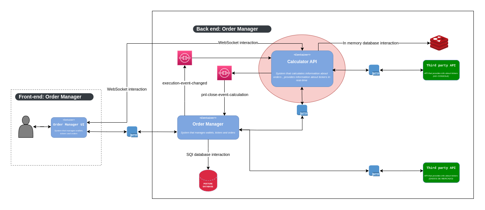

## Microservice: Investment calculator( Back-end ).

The application is a part of [investiment-manager](https://github.com/joseMarciano/investments-manager) project, where the user can invest with security and monitor investments easily
- This application calculates and send information in real time about profit and loss of client;

## :wrench: Architecture flowchart

## :ballot_box_with_check: Progress of the project

- [ ] Initialize application

### Api that is part of this project
- [investiment-manager](https://github.com/joseMarciano/investments-manager)

